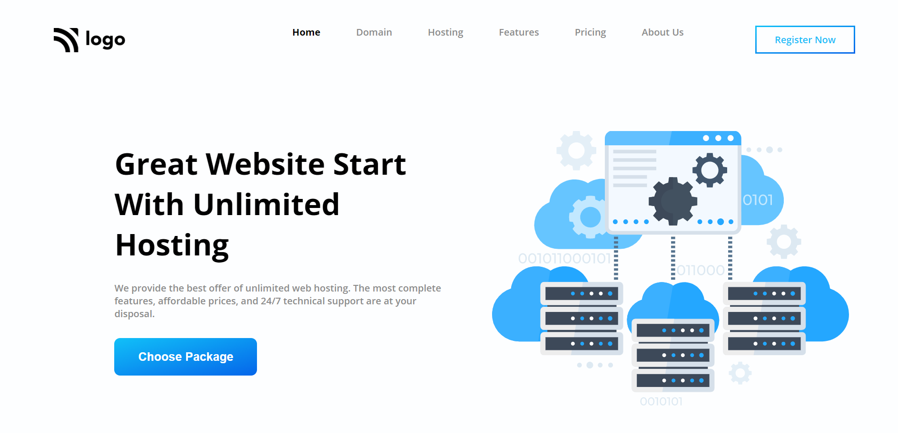

# Project-11
Done By  -   

  

This project is made, using Basic HTML and CSS.
 
  

 

 
  
 
 
  

 

  

 To complete this project, HTML elements which are properly enclosed in classes are used, 
so that it becomes easy while selecting and styling the elements using CSS.

 [Click-here for **Project Live Link**](https://htmlcss-project-11.netlify.app/)
  

 **_Screenshot_** :  

 

 

### By completing this project, I learnt many things about CSS. Few include:

- Learned about border image property in css.
- Designing Pricing section.
- Styling buttons using linear gradient.

 ### It took me around 7.5 hours to complete this project ! 